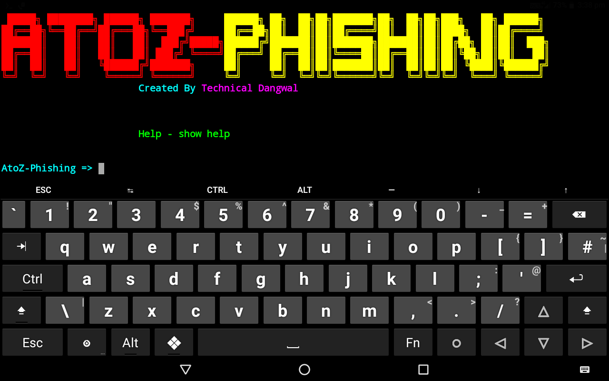

# AtoZ-Phishing
AtoZ-Phishing is a python based tool to create ph1shing pages.

## Installation

* `apt update && apt upgrade`

*`pkg install git -y`

*`git clone https://github.com/TechnicalDangwal/AtoZ-Phishing`

*`cd AtoZ-Phishing`

*`chmod +x *`

*`python AtoZPhishing.py`

after run this tool you just type `help`

## Usage

__start__
- from this option you can start your attack (example
AtoZ-Phishing => start                                                
No.: Type the number according to given sequence (by type show in terminal)
)

__show__
- from this option you can see all phishing sites.

__search__
- By typing search you can find whatever you want related to phishing sites (example: search
search: insta
you will get all ph1shing site related to insta)

__id__
- It show your save ids.

__removeid__
- If you want to remove your save ids then type removeids.

__uninstall__
– if you want to delete this tool then type uninstall and here it is done.

__subscribe__
- You can enter into my channel by easily type subscribe.

__exit__
- Want to exit then write exit.

## Thanks
AdvPhishing author for sites
